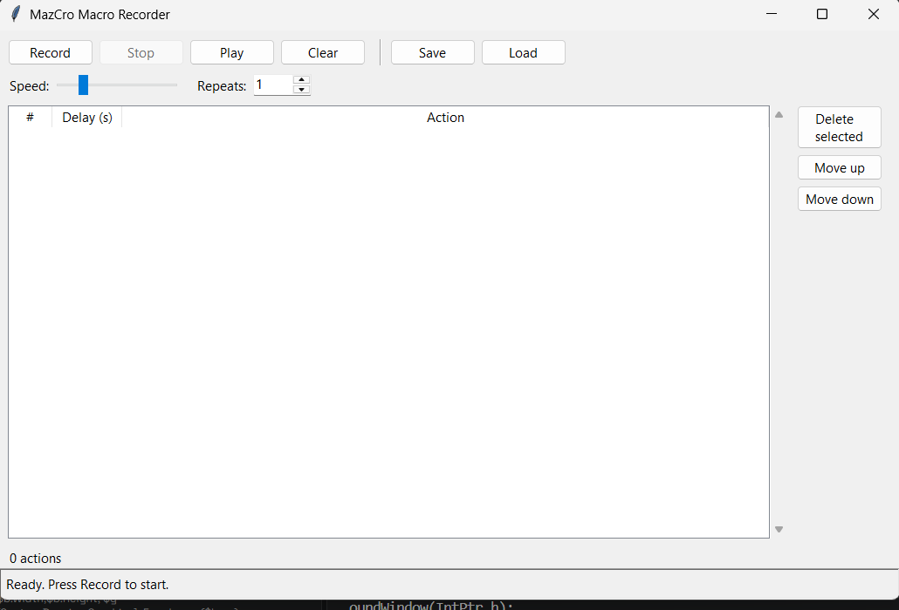

# MazCro

A Windows macro recorder and player with a graphical UI, written in Python.

MazCro records your mouse and keyboard activity and replays it on demand —
useful for repetitive form filling, game sequences, testing, or any task you
would otherwise click through dozens of times.



## Features

- **Record** mouse movement, clicks (left/right/middle), scrolling and keystrokes
- **Playback** with an adjustable **speed multiplier** (0.25x – 4x) and **repeat count**
- **Action list** with per-row delete, move up and move down reordering
- **Save / Load** macros as portable JSON files
- **Auto-filtering** — events happening over MazCro's own window are ignored, so the UI doesn't record itself
- **Failsafe** — slam the mouse into any screen corner during playback to abort instantly
- **Esc** stops a recording
- Fully non-blocking: recording and playback run on background threads so the UI never freezes

## Building a standalone EXE

### Downloading a prebuilt EXE

Go to the [Releases page](https://github.com/Mazt08/MazCro/releases) and download the
latest `MazCro-*.zip`. Unzip it and double-click `MazCro.exe` — no Python installation
required. A SHA256 checksum file is published alongside each release so you can verify
the download.

### Building it yourself

MazCro ships two PyInstaller configurations:

| Spec                  | Result                                             | Best for                          |
| --------------------- | -------------------------------------------------- | --------------------------------- |
| `MazCro-onefile.spec` | one `MazCro.exe` (~13 MB)                          | distributing to other people      |
| `MazCro.spec`         | `dist\MazCro\MazCro.exe` plus `_internal\` (~4 MB) | faster startup, smaller footprint |

```powershell
.\.venv\Scripts\python.exe -m pip install pyinstaller

# single file, easiest to share
.\.venv\Scripts\python.exe -m PyInstaller --clean --noconfirm MazCro-onefile.spec

# or folder build, starts faster
.\.venv\Scripts\python.exe -m PyInstaller --clean --noconfirm MazCro.spec
```

Both spec files explicitly list `pynput`'s and `pyautogui`'s win32 backends as hidden
imports, because both libraries choose their platform backend at runtime and would
otherwise be stripped out of the build — producing an app that opens and then crashes
the moment you press **Record**.

### Releasing a new version

Tag and push, and GitHub Actions builds and publishes the EXE for you:

```powershell
git tag v1.0.0
git push origin v1.0.0
```

You can also trigger the build manually from the repo's **Actions** tab via
_Build Windows EXE → Run workflow_, which leaves the EXE available under the run's
artifacts.

## Requirements

- Windows (uses `pyautogui` and global input listeners)
- Python 3.10+

## Installation

```powershell
git clone https://github.com/Mazt08/MazCro.git
cd MazCro
python -m venv .venv
.\.venv\Scripts\python.exe -m pip install -r requirements.txt
```

## Usage

```powershell
.\.venv\Scripts\python.exe main.py
```

1. Click **Record**, then perform the actions you want to capture
2. Press **Esc** (or click **Stop**) to finish
3. Adjust **Speed** and **Repeats** if needed
4. Click **Play** — the macro replays after a short 300 ms delay so you can switch windows

Use **Save** to store a macro as JSON and **Load** to play it back later.

## How it works

| Class      | Responsibility                                                              |
| ---------- | --------------------------------------------------------------------------- |
| `Action`   | Dataclass describing one recorded event plus its relative delay             |
| `Recorder` | `pynput` listener thread that converts raw input into `Action` objects      |
| `Player`   | Worker thread that feeds actions to `pyautogui`, scaled by the speed factor |
| `MacroApp` | Tkinter UI: buttons, action table, save/load, playback control              |

Delays are stored **relative to the previous event**, so playback timing scales
cleanly with the speed multiplier and macros stay portable across machines.

## Disclaimer

Recording and replaying input can violate the terms of service of online games
and applications, and may be detected by anti-cheat systems. Use MazCro only
for automation you are permitted to automate.

## License

MIT
